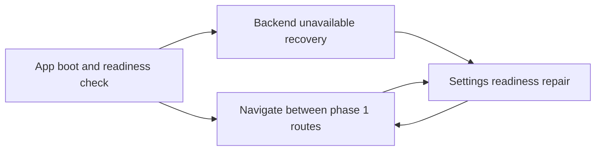

# BE + Simple UI Shell Flow Index

Stage: product-flow-map / Stage 2 MAP

Status: draft for review

Source inventory:

- [Feature Inventory](./01-feature-inventory.md)

## Flow List

| # | Flow | Persona | Screens Touched | Depends On |
|---|---|---|---|---|
| 1 | [App boot and readiness check](./02-flows/app-boot-readiness.md) | Founder Writer, Codex Operator | App Shell, Writer Route, Top Status Bar | `/status`, route registry |
| 2 | [Navigate between phase 1 routes](./02-flows/route-navigation.md) | Founder Writer | App Shell, Writer, Voice, Post Library, Settings | app shell, route registry |
| 3 | [Backend unavailable recovery](./02-flows/backend-unavailable-recovery.md) | Founder Writer, Codex Operator | App Shell, Top Status Bar, Route Error Banner, Settings | API client, error schema |
| 4 | [Settings readiness repair](./02-flows/settings-readiness-repair.md) | Founder Writer, Codex Operator | Settings, Top Status Bar, Writer | `/status`, settings persistence boundary |

## Screen Usage Matrix

| Screen / Region | App Boot | Route Navigation | Backend Recovery | Settings Repair |
|---|---|---|---|---|
| App Shell | Yes | Yes | Yes | Yes |
| Top Status Bar | Yes | Yes | Yes | Yes |
| Sidebar Nav | Yes | Yes | Yes | Yes |
| Writer Route | Yes | Yes | Yes | Yes |
| Voice Route | No | Yes | No | No |
| Post Library Route | No | Yes | No | No |
| Settings Route | No | Yes | Yes | Yes |
| Route Error Banner | Partial | No | Yes | Yes |

## Cross-Flow Dependencies

## Canonical Screen Names

| Screen | Route | Type |
|---|---|---|
| App Shell | All routes | Layout |
| Top Status Bar | All routes | Persistent region |
| Sidebar Nav | All routes | Persistent navigation |
| Writer Route | `/writer` | Page |
| Voice Route | `/voice` | Page |
| Post Library Route | `/library` | Page |
| Settings Route | `/settings` | Page |
| Route Error Banner | Route-local | Inline feedback |

## Assumptions To Validate

- Routes are URL-backed from day one.
- Detailed readiness lives at `/status`; `/health` can remain liveness-only.
- Settings is minimally editable in this epic for local command/path fields, but full Codex adapter behavior belongs to the Codex adapter epic.
- Storage can start as a readiness boundary even if persistence implementation lands later.

