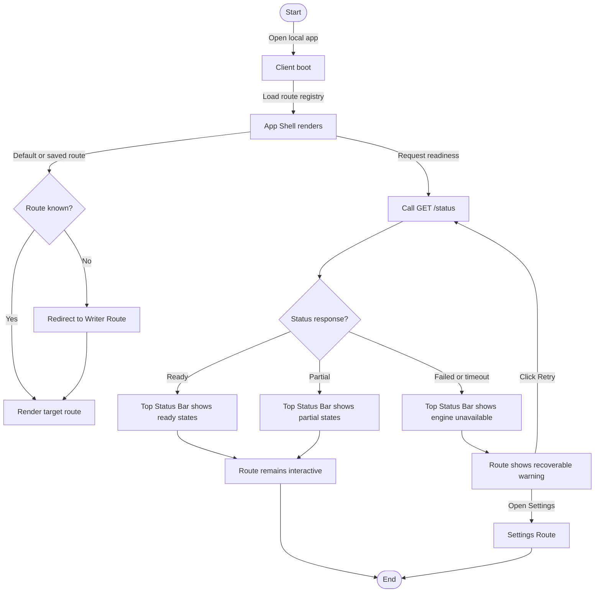

# Flow: App Boot And Readiness Check

## Context

The founder opens the local app and needs to know whether the shell, local engine, Codex adapter, and storage boundary are usable. The flow should make partial readiness visible without blocking the whole app.

## Entry Points

- Browser URL: `/writer`
- Browser URL: `/`
- Codex/dev workflow: start local client and open app.
- Context: engine may be running, starting, misconfigured, or unavailable.

## Flow Diagram

## Step Descriptions

| # | Step | Description | Screen | Interactions |
|---|---|---|---|---|
| 1 | Open app | User opens `/` or a saved route. | App Shell | Browser navigation |
| 2 | Render shell | Client renders top status, sidebar, and route outlet before backend readiness completes. | App Shell | No blocking loader |
| 3 | Resolve route | Unknown route redirects to `/writer`; known route renders directly. | App Shell | URL route |
| 4 | Check readiness | Client calls `GET /status`. | Top Status Bar | Per-status loading indicator |
| 5 | Show ready | Engine, storage, and Codex states render as ready. | Top Status Bar | Badges with text |
| 6 | Show partial | Deterministic engine ready but Codex/storage partial. | Top Status Bar | Partial badge and Settings link |
| 7 | Show failed | Engine request fails or times out. | Route Error Banner | Retry and Settings actions |

## Error Paths

| Step | Error | User Sees | Recovery |
|---|---|---|---|
| Check readiness | `/status` timeout | Status badge: `Engine unavailable`; route warning remains inline | Retry status; open Settings |
| Resolve route | Unknown URL | Redirect to Writer route | User lands in safe default route |
| Render shell | Route component throws | Route error banner; shell stays mounted | Retry route; navigate elsewhere |
| Status parse | Malformed response | Warning: `Status response invalid` | Retry; report schema mismatch in console/dev logs |

## Edge Cases

- First app launch with no stored route: open Writer by default.
- Last route was deferred or removed: open Writer and show no scary error.
- Engine starts slowly: shell renders immediately; status remains `checking`.
- Codex unavailable: status shows partial; Writer route remains usable.
- Storage unavailable: status shows warning; routes that need persistence show their own local warning later.

## Screen References

| Screen | Route | Type |
|---|---|---|
| App Shell | All routes | Layout |
| Top Status Bar | All routes | Persistent region |
| Writer Route | `/writer` | Page |
| Settings Route | `/settings` | Page |
| Route Error Banner | Route-local | Inline feedback |

## Cross-Flow References

- Leads to [Backend unavailable recovery](./backend-unavailable-recovery.md) when `/status` fails.
- Leads to [Settings readiness repair](./settings-readiness-repair.md) when user chooses to inspect readiness.
- Enables [Navigate between phase 1 routes](./route-navigation.md) after shell renders.

## Open Questions

- Should `/` redirect to `/writer` or render `/writer` without changing the URL?
- What timeout should classify `/status` as unavailable in local development?
- Should detailed readiness live only at `/status`, leaving `/health` as liveness?

## Metrics / Content / Service Notes

- Primary metric: app boot completes with shell rendered and readiness visible.
- Events to instrument: `app_boot_started`, `app_shell_rendered`, `status_check_started`, `status_check_completed`, `status_check_failed`.
- UX copy needed: engine unavailable warning, partial readiness copy, invalid status copy.
- Dependencies: client route registry, API client, engine `/status`, shared status schema.
- Accessibility risk: top status changes need polite announcements; route errors need reachable retry actions.

