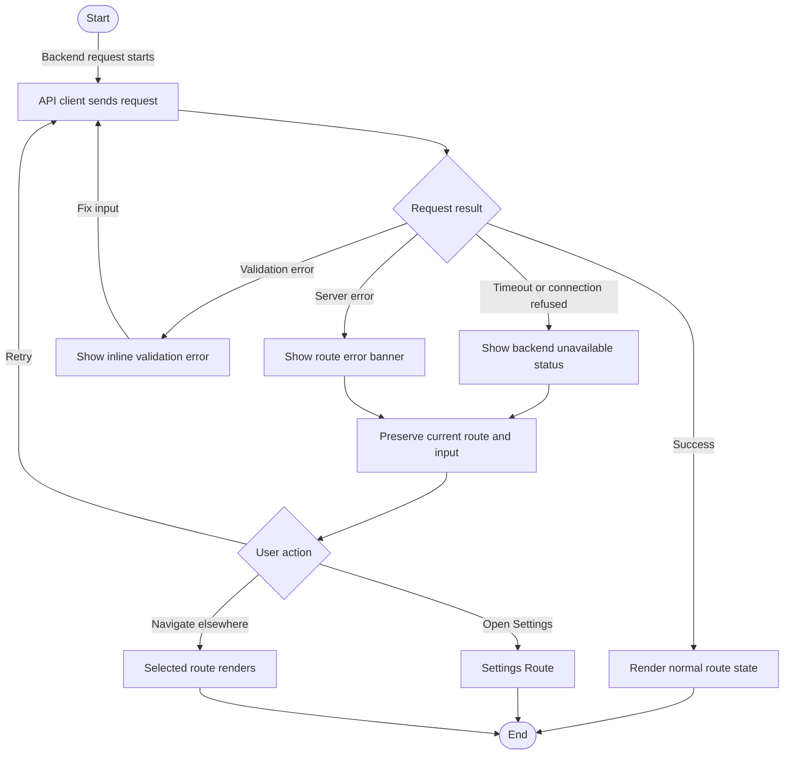

# Flow: Backend Unavailable Recovery

## Context

The user opens the app or triggers route work while the local engine is not reachable. The shell must keep navigation usable, explain what failed, and offer retry or Settings without losing input.

## Entry Points

- App boot status check fails.
- User clicks Generate while engine is down.
- User navigates to a route that needs backend data.
- Codex asks the app to show current state while engine process is stopped.

## Flow Diagram

## Step Descriptions

| # | Step | Description | Screen | Interactions |
|---|---|---|---|---|
| 1 | Request starts | Route or status bar calls backend through API client. | Current route | Button, boot status, data load |
| 2 | Classify result | API client classifies success, validation, connection, timeout, or server error. | API boundary | Error schema |
| 3 | Preserve work | Current route remains mounted; text inputs and selected route are preserved. | Current route | No forced refresh |
| 4 | Show recovery | User sees retry and Settings actions near the failed area. | Route Error Banner / Top Status Bar | Retry, Settings |
| 5 | Retry | User retries the exact failed operation. | Current route | Retry button |
| 6 | Navigate | User can continue to another route despite backend failure. | App Shell | Sidebar |

## Error Paths

| Step | Error | User Sees | Recovery |
|---|---|---|---|
| Status check | Engine stopped | Top status: `Engine unavailable`; warning says local server is not reachable | Retry; start engine; open Settings |
| Generate request | Connection refused | Writer banner: `Could not reach local engine. Your idea is still here.` | Retry after starting engine |
| Generate request | Validation error | Inline field error near idea input | Fix input and submit again |
| Backend response | 500 server error | Route banner with error code and retry | Retry; inspect logs |
| Error schema | Unknown error shape | Generic recoverable message | Retry; log raw error for development |

## Edge Cases

- User typed a long idea before engine failed: textarea value stays intact.
- User navigates away after failure and returns: route state is preserved if in-memory route state still exists.
- Engine recovers in background: status bar can update without forcing route reload.
- Multiple panels fail differently: show panel-local errors, not one global blocker.
- Settings route itself cannot load backend status: show local editable fields plus status error.

## Screen References

| Screen | Route | Type |
|---|---|---|
| App Shell | All routes | Layout |
| Top Status Bar | All routes | Persistent region |
| Writer Route | `/writer` | Page |
| Settings Route | `/settings` | Page |
| Route Error Banner | Route-local | Inline feedback |

## Cross-Flow References

- Entered from [App boot and readiness check](./app-boot-readiness.md) when `/status` fails.
- Can send user to [Settings readiness repair](./settings-readiness-repair.md).
- User can recover via [Navigate between phase 1 routes](./route-navigation.md).

## Open Questions

- Should the UI show the exact local server URL in recovery copy?
- Should retry happen automatically for status checks, or only manually?
- How much raw error detail should be visible in an internal tool?

## Metrics / Content / Service Notes

- Primary metric: user can recover or continue after backend failure without losing route/input state.
- Events to instrument: `api_request_failed`, `backend_unavailable_shown`, `backend_retry_clicked`, `backend_recovered`, `settings_opened_from_error`.
- UX copy needed: local engine unavailable, timeout, validation, server error, retry copy.
- Dependencies: API client, shared API error schema, route error component, `/status`.
- Accessibility risk: error messages should use assertive announcement only for blocking route failures; focus should remain predictable after retry.

