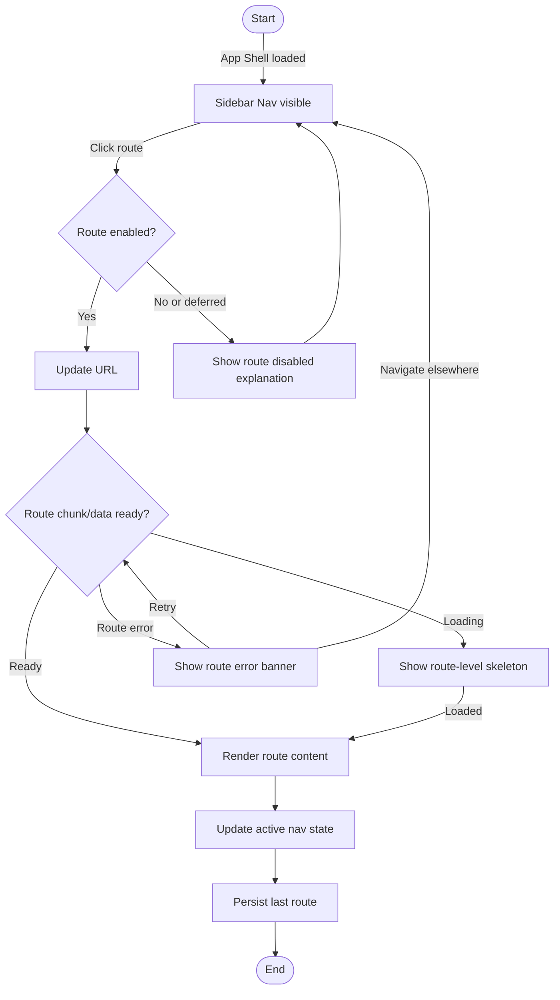

# Flow: Navigate Between Phase 1 Routes

## Context

The founder moves between Writer, Voice, Post Library, and Settings while the app shell stays stable. Navigation should preserve route context where useful and never hide global readiness.

## Entry Points

- Sidebar Nav route item.
- Direct browser URL: `/writer`, `/voice`, `/library`, `/settings`.
- Settings link from status or route warning.
- Future command palette entry.

## Flow Diagram

## Step Descriptions

| # | Step | Description | Screen | Interactions |
|---|---|---|---|---|
| 1 | View nav | Sidebar shows Writer, Voice, Post Library, Settings. | Sidebar Nav | Route links |
| 2 | Select route | User clicks route or lands by URL. | App Shell | Link click or browser nav |
| 3 | Validate route | Client checks whether route exists and is enabled. | App Shell | Route registry lookup |
| 4 | Render route | Route outlet renders selected route content. | Writer/Voice/Library/Settings | Page content |
| 5 | Show active state | Sidebar active route updates with text and marker. | Sidebar Nav | `aria-current` |
| 6 | Persist context | Last route and sidebar state persist locally. | App Shell | Local storage boundary |

## Error Paths

| Step | Error | User Sees | Recovery |
|---|---|---|---|
| Validate route | Unknown route path | Redirect to Writer route | User can continue |
| Validate route | Deferred route selected | Disabled or coming-later explanation | Choose enabled route |
| Render route | Route component error | Route-local error banner | Retry route or navigate elsewhere |
| Persist context | Local storage write fails | Silent non-blocking warning in dev console; app still navigates | Continue without persistence |

## Edge Cases

- User opens `/settings` directly: shell renders with Settings active.
- User opens a phase 2 route before it exists: route resolves to safe not-found or disabled state, not blank page.
- Sidebar collapses: visual labels can hide, but accessible labels remain.
- Backend unavailable: navigation still works; route panels show their own backend-dependent warnings.
- Voice/Post Library not implemented deeply yet: show useful placeholder/empty state, not a blank screen.

## Screen References

| Screen | Route | Type |
|---|---|---|
| App Shell | All routes | Layout |
| Sidebar Nav | All routes | Persistent navigation |
| Writer Route | `/writer` | Page |
| Voice Route | `/voice` | Page |
| Post Library Route | `/library` | Page |
| Settings Route | `/settings` | Page |

## Cross-Flow References

- Starts after [App boot and readiness check](./app-boot-readiness.md).
- Enters [Settings readiness repair](./settings-readiness-repair.md) when Settings is selected.
- Supports recovery from [Backend unavailable recovery](./backend-unavailable-recovery.md) by letting user navigate away.

## Open Questions

- Should sidebar collapsed state persist from day one?
- Should disabled phase 2 routes appear at all before phase 2 starts?
- Should route placeholders be owned by shell or by each feature folder?

## Metrics / Content / Service Notes

- Primary metric: route navigation succeeds without shell remount or blank states.
- Events to instrument: `route_navigation_clicked`, `route_rendered`, `route_render_failed`, `unknown_route_redirected`.
- UX copy needed: route placeholder copy, deferred route explanation, route error banner.
- Dependencies: client router, route registry, local UI preference storage.
- Accessibility risk: active route needs `aria-current`; collapsed sidebar must retain labels.

