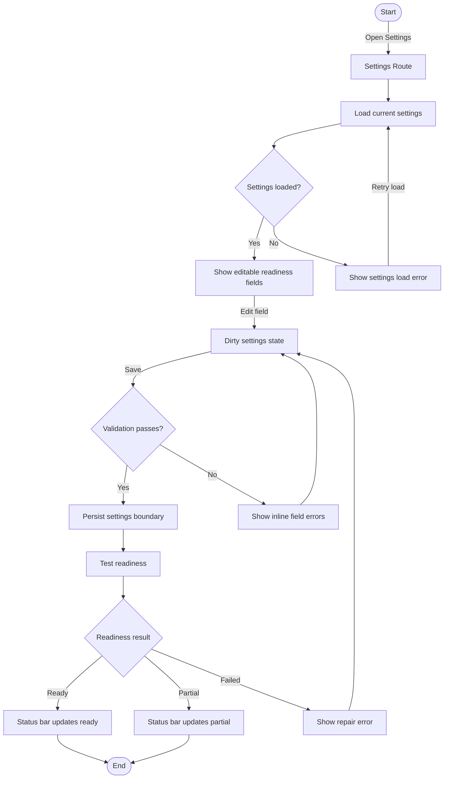

# Flow: Settings Readiness Repair

## Context

The founder uses Settings to inspect or repair shell-owned readiness fields: local engine URL, Codex command labels, storage path, and feature flags. This epic should provide the shell-level settings surface without owning the full Codex adapter implementation.

## Entry Points

- Sidebar Nav: Settings.
- Top Status Bar: click partial/failed Codex or storage status.
- Route Error Banner: click Open Settings.
- Direct URL: `/settings`.

## Flow Diagram

## Step Descriptions

| # | Step | Description | Screen | Interactions |
|---|---|---|---|---|
| 1 | Open Settings | User navigates to Settings from nav, status, error, or direct URL. | Settings Route | Link click |
| 2 | Load settings | Client loads local settings or default config. | Settings Route | Skeleton or current values |
| 3 | Edit readiness fields | User changes shell-owned fields such as engine URL, storage path, and command labels. | Settings Route | Inputs, switches |
| 4 | Validate | Client validates required fields and path/URL shape. | Settings Route | Inline errors |
| 5 | Persist boundary | Settings save updates local boundary or placeholder persistence. | Settings Route | Save button |
| 6 | Test readiness | User tests or auto-refreshes `/status`. | Settings Route / Top Status Bar | Test adapter/status |
| 7 | Return to work | User navigates back to Writer or previous route. | Sidebar Nav / App Shell | Route nav |

## Error Paths

| Step | Error | User Sees | Recovery |
|---|---|---|---|
| Load settings | Settings file unavailable | Panel error with retry and defaults option | Retry load; use defaults |
| Validate | Invalid engine URL/path | Inline field error | Fix field |
| Persist | Save failed | Sticky save bar remains; error near save action | Retry save |
| Test readiness | Codex command timeout | Warning: `Judge command timed out. Deterministic engine still available.` | Retry test; continue partial |
| Test readiness | Storage not writable | Storage warning with path field highlighted | Change path; retry |

## Edge Cases

- User opens Settings from a failed Writer request: previous route should be remembered for return.
- User edits settings but navigates away: warn if unsaved changes exist.
- Codex writer ready but judge failed: status is partial, not failed.
- Deterministic engine ready with Codex disabled: status is usable partial.
- Settings save succeeds but readiness still fails: keep settings saved; show readiness repair guidance.

## Screen References

| Screen | Route | Type |
|---|---|---|
| Settings Route | `/settings` | Page |
| Top Status Bar | All routes | Persistent region |
| Writer Route | `/writer` | Page |
| Route Error Banner | Route-local | Inline feedback |

## Cross-Flow References

- Entered from [Backend unavailable recovery](./backend-unavailable-recovery.md).
- Can return to [Navigate between phase 1 routes](./route-navigation.md).
- Uses status semantics from [App boot and readiness check](./app-boot-readiness.md).

## Open Questions

- What fields are shell-owned versus Codex adapter owned?
- Should settings persist to local storage first, then move to SQLite/file storage later?
- Should a successful readiness repair automatically return to the previous route?
- Should engine URL be configurable if app is always local at `127.0.0.1:8787`?

## Metrics / Content / Service Notes

- Primary metric: user can identify and repair readiness issues from Settings.
- Events to instrument: `settings_opened`, `settings_dirty`, `settings_save_clicked`, `settings_save_failed`, `readiness_test_clicked`, `readiness_repaired`.
- UX copy needed: dirty settings warning, save failure, readiness partial, Codex timeout, storage path invalid.
- Dependencies: settings schema, local persistence boundary, `/status`, top status updater.
- Accessibility risk: dirty/save errors need inline field association; save bar must be reachable by keyboard.

