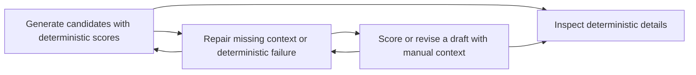

# Deterministic Engine Flow Index

Stage: product-flow-map / Stage 2 MAP

Status: draft for review

Source inventory:

- [Feature Inventory](./01-feature-inventory.md)

## Flow List

| # | Flow | Persona | Screens Touched | Depends On |
|---|---|---|---|---|
| 1 | [Generate candidates with deterministic scores](./02-flows/generate-candidates-with-deterministic-scores.md) | Founder Writer | Writer Route Deterministic Workbench, Manual Scoring Context Panel, Candidate Deterministic Summary, Deterministic Detail Inspector | `/ideas/generate`, future score schema |
| 2 | [Score or revise a draft with manual context](./02-flows/score-or-revise-draft-with-manual-context.md) | Founder Writer | Writer Route Deterministic Workbench, Manual Scoring Context Panel, Deterministic Detail Inspector | analyzer endpoint/composition |
| 3 | [Inspect deterministic details](./02-flows/inspect-deterministic-details.md) | Founder Writer | Candidate Deterministic Summary, Deterministic Detail Inspector | `derivePostCoachCard`, `predictEngagement` |
| 4 | [Repair missing context or deterministic failure](./02-flows/repair-missing-context-or-deterministic-failure.md) | Founder Writer, Deterministic Engine Implementer | Writer Route Deterministic Workbench, Manual Scoring Context Panel, Route Error Banner, Settings Route | app status, API errors |

## Screen Usage Matrix

| Screen / Region | Generate + Score | Score Draft | Inspect Details | Repair |
|---|---|---|---|---|
| Writer Route Deterministic Workbench | Yes | Yes | Yes | Yes |
| Manual Scoring Context Panel | Yes | Yes | Partial | Yes |
| Candidate Deterministic Summary | Yes | No | Yes | Partial |
| Deterministic Detail Inspector | Partial | Yes | Yes | Partial |
| Route Error Banner | Partial | Partial | No | Yes |
| Settings Route | No | No | No | Yes |

## Cross-Flow Dependencies

## Canonical Screen Names

| Screen | Route | Type |
|---|---|---|
| Writer Route Deterministic Workbench | `/writer` | Page |
| Manual Scoring Context Panel | `/writer` | Panel |
| Candidate Deterministic Summary | within Writer candidate board | Component region |
| Deterministic Detail Inspector | within Writer route, right inspector or drawer | Inspector / Drawer |
| Route Error Banner | route-local | Banner |
| Settings Route | `/settings` | Page |

## Day-One Manual Inputs

| Input | Required? | Why | Default / Empty Behavior |
|---|---:|---|---|
| Post text / generated candidate text | Yes | Analyzer cannot score empty text. | Empty Post Coach state; generate/score disabled. |
| Follower count | Yes for prediction range; not required for voice checks | `predictEngagement` scales impressions from follower count. | Prediction card disabled with recovery CTA. Do not silently rely on `1000` without visible label. |
| AI rating | No | Optional quality multiplier, likely populated by later LLM judge. | Hidden behind advanced/manual calibration or omitted day one. |
| Recent post history | No | Enables variety check. | Show variety unavailable or general guidance. |
| Voice profile / known posts | No for current analyzer; required for stronger future scoring | Product strategy depends on voice, but analyzer has static rules now. | Mark as not yet connected; do not block day-one scoring. |

## Assumptions To Validate

- Day-one UI asks for manual follower count before showing Engagement Prediction.
- `aiRating` is not a primary day-one input.
- Scored generation should probably return analysis in the same response to reduce async states, but architecture can decide after this spec.
- The Writer route is the canonical home for deterministic scoring UI.
