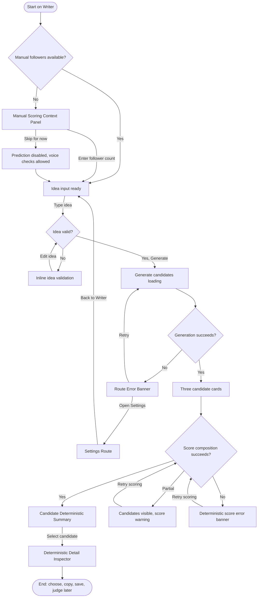

# Flow: Generate Candidates With Deterministic Scores

## Context

A founder enters a raw idea and expects three post candidates. Day one must generate candidates and run deterministic scoring even when Codex judge is unavailable. Because there is no X integration, the user supplies follower count manually before impression ranges are shown.

## Entry Points

- Sidebar Nav: Writer.
- Default route: `/writer`.
- Retry from Route Error Banner after a failed generation or scoring attempt.
- Return from Settings after repairing local engine readiness.

## Flow Diagram

## Step Descriptions

| # | Step | Description | Screen | Interactions |
|---|---|---|---|---|
| 1 | Open Writer | User sees idea input, manual context, and empty candidate board. | Writer Route Deterministic Workbench | Sidebar or direct route. |
| 2 | Confirm manual followers | User enters follower count or continues with prediction disabled. | Manual Scoring Context Panel | Numeric input, save/apply, skip. |
| 3 | Enter idea | User writes raw idea. | Writer Route Deterministic Workbench | Textarea, validation helper. |
| 4 | Generate | System calls generation and then scoring composition. | Writer Route Deterministic Workbench | Generate button, skeletons, route status. |
| 5 | Render summaries | Three candidates show text, format, score, confidence/missing-context label, checks summary. | Candidate Deterministic Summary | Select, inspect, copy later. |
| 6 | Inspect selected candidate | User opens deterministic details. | Deterministic Detail Inspector | Detail action, candidate selection. |
| 7 | Continue decision | User can choose, copy, save, or send to Codex judge later. | Writer Route Deterministic Workbench | Later writer actions. |

## Error Paths

| Step | Error | User Sees | Recovery |
|---|---|---|---|
| Confirm manual followers | Empty, zero, negative, or non-integer followers | Inline field error: `Enter your current follower count to estimate impressions.` | Correct field or skip prediction. |
| Generate | Idea is empty or too long | Field-local validation under idea textarea | Edit idea; request is not sent. |
| Generate | Engine unavailable or timeout | Route Error Banner: idea preserved, local engine unavailable | Retry or open Settings. |
| Score composition | Generated candidates returned but scoring failed | Candidate cards remain with warning: `Deterministic score unavailable.` | Retry scoring without regenerating candidates. |
| Prediction | Followers missing | Engagement Prediction card disabled; Post Coach remains available | Enter followers inline or Settings default. |
| Response parsing | API response does not match schema | Route Error Banner: invalid response, retryable | Retry; implementation logs parse detail. |

## Edge Cases

- User changes follower count after scores render: recompute prediction ranges only; do not regenerate candidate text.
- User edits idea after generation: mark existing candidate set as stale until they generate again.
- Codex judge unavailable: deterministic cards remain fully usable and show `Codex judge unavailable. Deterministic scoring still ran.` in judge-owned region later.
- Follower count is very small or very large: clamp only according to analyzer rules, show the entered value and "manual" source.
- Candidate text shorter than 15 chars: prediction is unavailable; Post Coach shows score/check state.
- User opens Settings and returns: idea text and generated candidates should be preserved if possible.

## Screen References

| Screen | Route | Type | Shared With |
|---|---|---|---|
| Writer Route Deterministic Workbench | `/writer` | Page | all deterministic flows |
| Manual Scoring Context Panel | `/writer` | Panel | score draft, repair |
| Candidate Deterministic Summary | within Writer | Component region | inspect details |
| Deterministic Detail Inspector | within Writer | Inspector / Drawer | score draft, inspect details |
| Route Error Banner | route-local | Banner | repair |
| Settings Route | `/settings` | Page | repair |

## Cross-Flow References

- -> [Inspect deterministic details](./inspect-deterministic-details.md) when the user opens details for a candidate.
- -> [Repair missing context or deterministic failure](./repair-missing-context-or-deterministic-failure.md) when followers, engine, or scoring is unavailable.
- <- [Score or revise a draft with manual context](./score-or-revise-draft-with-manual-context.md) shares manual context and detail inspector behavior.

## Open Questions

- Should `/ideas/generate` return scored candidates directly, or should scoring be a separate retryable call?
- What exact score dimensions should the first candidate summary show beyond the current analyzer's single `score.value`?
- Should a skipped follower count persist as an intentional state for the run?

## Metrics / Content / Service Notes

- Primary metric: idea to scored candidate set completed.
- Events to instrument: `deterministic_generate_started`, `manual_followers_entered`, `deterministic_scores_rendered`, `prediction_disabled_missing_followers`, `deterministic_scoring_failed`, `candidate_detail_opened`.
- UX copy/content needed: manual followers helper, heuristic label, scoring failure copy, stale candidate copy.
- Backstage dependencies: generation endpoint, analyzer composition, future score schemas, Settings persistence.
- Accessibility-critical states: score result live region, manual follower field error, retry focus, score bars with text labels.
