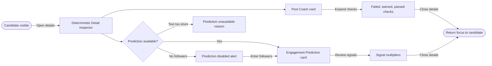

# Flow: Inspect Deterministic Details

## Context

The founder needs to understand why a candidate scored the way it did. The detail inspector exposes deterministic explanations without turning the score into an opaque verdict or hiding candidate comparison.

## Entry Points

- Candidate card: View deterministic details.
- Candidate selection in Writer route.
- Draft scorer after analysis completes.

## Flow Diagram

## Step Descriptions

| # | Step | Description | Screen | Interactions |
|---|---|---|---|---|
| 1 | Open details | User opens details from candidate or draft score. | Candidate Deterministic Summary | Details button. |
| 2 | Review Post Coach | Inspector shows score, badge, engageability, helper copy, and check counts. | Deterministic Detail Inspector | Expand/collapse details. |
| 3 | Review prediction | If followers and enough text exist, inspector shows impression range, confidence, and signals. | Deterministic Detail Inspector | Manual followers recovery if needed. |
| 4 | Close | User closes drawer/inspector and returns to comparison. | Deterministic Detail Inspector | Close button, Escape. |

## Error Paths

| Step | Error | User Sees | Recovery |
|---|---|---|---|
| Open details | Analysis missing for selected candidate | Inspector loading then warning | Retry deterministic score. |
| Review prediction | Missing followers | Disabled prediction card with input CTA | Enter follower count. |
| Review prediction | Prediction is null due to short text | Explanation: `Prediction needs at least 15 characters.` | Edit or choose longer candidate. |
| Close | Drawer has focus trap bug | Should never happen | Implementation QA: focus returns to details trigger. |

## Edge Cases

- Long check labels wrap within the inspector and never push controls off screen.
- Multiple candidates can share the inspector; switching selected candidate updates content and announces the new candidate label.
- Hidden/preview Post Coach mode should show sample checks only in compact candidate cards; inspector uses expanded detail by default.
- Prediction signals must show multiplier text, not color-only strength.

## Screen References

| Screen | Route | Type | Shared With |
|---|---|---|---|
| Candidate Deterministic Summary | within Writer | Component region | generate flow |
| Deterministic Detail Inspector | within Writer | Inspector / Drawer | all deterministic flows |
| Manual Scoring Context Panel | `/writer` | Panel | repair missing followers |

## Cross-Flow References

- <- [Generate candidates with deterministic scores](./generate-candidates-with-deterministic-scores.md)
- <- [Score or revise a draft with manual context](./score-or-revise-draft-with-manual-context.md)
- -> [Repair missing context or deterministic failure](./repair-missing-context-or-deterministic-failure.md)

## Open Questions

- Should the inspector be persistent on desktop and a drawer on tablet/mobile?
- Should Post Coach default expanded or collapsed after the user has seen it once?
- Should `learnings` be hidden until real imported data exists, since current analyzer uses static learning copy?

## Metrics / Content / Service Notes

- Primary metric: details opened for a generated or drafted post.
- Events to instrument: `deterministic_detail_opened`, `post_coach_expanded`, `prediction_signal_viewed`, `detail_closed`.
- UX copy/content needed: prediction unavailable reasons, manual context CTA, helper copy for heuristics.
- Backstage dependencies: analysis result attached to selected candidate, manual followers state.
- Accessibility-critical states: inspector focus trap, Escape close, live updates when selected candidate changes.
