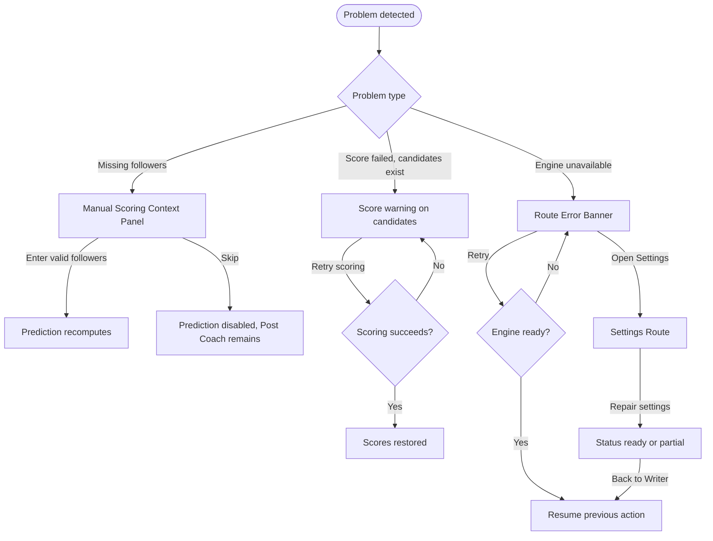

# Flow: Repair Missing Context Or Deterministic Failure

## Context

Day-one deterministic scoring depends on local engine readiness and manual user input. The UI must distinguish missing followers, unavailable prediction, scoring failure, and full engine failure without losing text or generated candidates.

## Entry Points

- Manual Scoring Context Panel when followers are missing.
- Route Error Banner after generation or scoring fails.
- Top Status Bar shows deterministic scorer unavailable.
- Deterministic Detail Inspector cannot load analysis.

## Flow Diagram

## Step Descriptions

| # | Step | Description | Screen | Interactions |
|---|---|---|---|---|
| 1 | Classify issue | UI distinguishes missing context from system failure. | Writer Route Deterministic Workbench | Status, alert, inline field state. |
| 2 | Repair followers | User enters valid follower count. | Manual Scoring Context Panel | Numeric input, Apply. |
| 3 | Retry scoring | User retries score calculation without regenerating candidate text. | Candidate Deterministic Summary | Retry score action. |
| 4 | Repair engine | User retries or opens Settings. | Route Error Banner, Settings Route | Retry, Open Settings, Back to Writer. |
| 5 | Resume | Previous idea/draft/candidates remain visible where possible. | Writer Route Deterministic Workbench | Continue from preserved context. |

## Error Paths

| Step | Error | User Sees | Recovery |
|---|---|---|---|
| Repair followers | Invalid value | Inline field error | Correct value. |
| Retry scoring | Analyzer still fails | Persistent warning near affected candidates | Retry later, keep candidate text. |
| Repair engine | `/status` unavailable | Settings shows engine/status failure | Restart engine; retry status. |
| Resume | Prior route state lost | Empty Writer with non-blaming copy | Re-enter idea; no false success state. |

## Edge Cases

- Followers missing is not an error if the user only wants Post Coach checks.
- Score failure should not clear generated candidate text.
- Generation retry should regenerate candidates; scoring retry should not.
- If Settings changes default followers, current run should ask whether to apply the new value to visible candidates.
- If deterministic scorer is unavailable but existing scored candidates are cached, show stale/last scored timestamp.

## Screen References

| Screen | Route | Type | Shared With |
|---|---|---|---|
| Writer Route Deterministic Workbench | `/writer` | Page | all deterministic flows |
| Manual Scoring Context Panel | `/writer` | Panel | generate, score draft |
| Candidate Deterministic Summary | within Writer | Component region | generate, inspect |
| Route Error Banner | route-local | Banner | shell recovery |
| Settings Route | `/settings` | Page | shell settings |

## Cross-Flow References

- <- [Generate candidates with deterministic scores](./generate-candidates-with-deterministic-scores.md)
- <- [Score or revise a draft with manual context](./score-or-revise-draft-with-manual-context.md)
- -> [Inspect deterministic details](./inspect-deterministic-details.md) once analysis is restored.

## Open Questions

- Should missing followers use an inline alert, a compact panel warning, or both?
- Do we need a separate `score_failed` API error scope, or reuse `writer`/`field` scopes?
- How should cached/stale deterministic analysis be represented in the shared schema?

## Metrics / Content / Service Notes

- Primary metric: user repairs missing context or scorer failure and returns to scoring.
- Events to instrument: `manual_context_missing`, `manual_context_applied`, `deterministic_score_retry`, `deterministic_score_recovered`, `deterministic_engine_settings_opened`.
- UX copy/content needed: context missing, score failed, retry, stale score, Settings return.
- Backstage dependencies: API error schema, status endpoint, Settings persistence.
- Accessibility-critical states: focus to invalid followers input, assertive announcement for user-triggered failures, preserved focus after retry.
