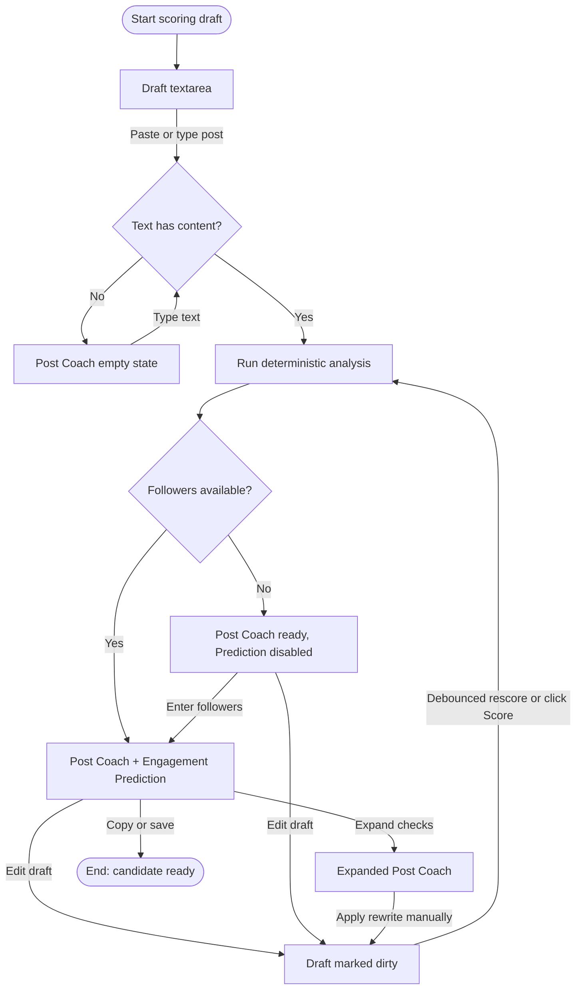

# Flow: Score Or Revise Draft With Manual Context

## Context

The founder may already have a draft and want deterministic feedback before asking Codex or publishing. This path is the cleanest day-one no-X workflow: paste text, optionally add manual follower count, inspect Post Coach, revise, and rescore.

## Entry Points

- Writer route draft scoring area.
- Detail action from a generated candidate, followed by editing a draft copy.
- Future Post Library row action: Score post.

## Flow Diagram

## Step Descriptions

| # | Step | Description | Screen | Interactions |
|---|---|---|---|---|
| 1 | Open draft scorer | User sees empty draft area and context panel. | Writer Route Deterministic Workbench | Route entry or candidate edit. |
| 2 | Add post text | User pastes a draft or edits generated text. | Writer Route Deterministic Workbench | Textarea, Score button or debounced scoring. |
| 3 | Analyze | System runs `analyzePost` and derives cards. | Deterministic Detail Inspector | Loading state then cards. |
| 4 | Add manual followers | User supplies follower count if prediction is desired. | Manual Scoring Context Panel | Numeric input, Apply. |
| 5 | Revise | User edits text using failed/warned checks. | Writer Route Deterministic Workbench | Edit textarea, rescore. |
| 6 | Conclude | User copies, saves, or keeps the revised draft. | Writer Route Deterministic Workbench | Later writer actions. |

## Error Paths

| Step | Error | User Sees | Recovery |
|---|---|---|---|
| Add post text | Text exceeds API/schema max | Field error; text preserved | Shorten text. |
| Analyze | Deterministic analyzer throws or endpoint fails | Inline alert in detail area; draft preserved | Retry score. |
| Add manual followers | Invalid number | Field error near followers input | Correct value or continue without prediction. |
| Revise | Scoring result lags behind draft | Stale badge: `Draft changed. Score again.` | Click Score or wait for debounce. |

## Edge Cases

- Empty text should use the analyzer's empty Post Coach state, not a blank panel.
- Very short text can produce no prediction; show why rather than hiding the card.
- Manual follower count changes should update only Engagement Prediction, not Post Coach checks.
- Debounced scoring must not trap keyboard users; provide an explicit Score action.
- Pasted multiline text must preserve intentional line breaks.

## Screen References

| Screen | Route | Type | Shared With |
|---|---|---|---|
| Writer Route Deterministic Workbench | `/writer` | Page | generate flow |
| Manual Scoring Context Panel | `/writer` | Panel | generate, repair |
| Deterministic Detail Inspector | within Writer | Inspector / Drawer | inspect details |

## Cross-Flow References

- -> [Repair missing context or deterministic failure](./repair-missing-context-or-deterministic-failure.md) when scoring fails or followers are absent.
- -> [Inspect deterministic details](./inspect-deterministic-details.md) when the user expands cards.

## Open Questions

- Should draft scoring be always-on after debounce, explicit only, or both?
- Should editing a generated candidate create a new candidate revision id?
- Should day-one save persist both original candidate text and revised draft text?

## Metrics / Content / Service Notes

- Primary metric: draft scored and revised at least once.
- Events to instrument: `draft_score_started`, `draft_score_completed`, `post_coach_expanded`, `manual_followers_applied`, `draft_rescored`.
- UX copy/content needed: empty Post Coach copy, stale score copy, invalid follower copy.
- Backstage dependencies: score endpoint or client-side composition, persistence later.
- Accessibility-critical states: live score update, dirty/stale status, textarea error association.
