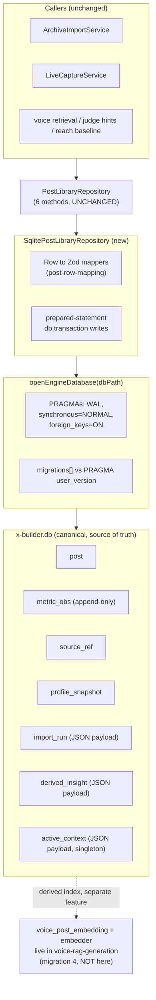
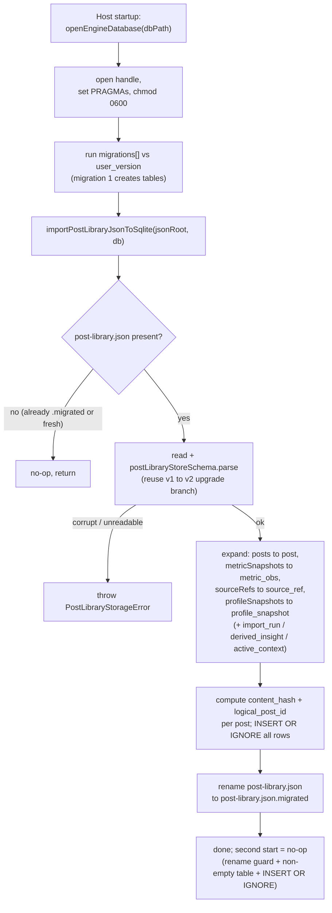

# Local Persistence Foundation — Architecture

This document is the design for migration 1 of the local SQLite store: the base relational schema, the database open/migration mechanism, the SQLite-backed repository, and the one-time JSON importer. Later local-data features append migrations to the same runner; `voice-rag-generation` now appends the local voice projection as migration 4.

## Storage layering

The corpus is reached only through the 6-method `PostLibraryRepository` interface. This feature replaces the implementation behind it — JSON file → SQLite — and leaves the interface, the store shapes, and the transport seam untouched.



The split that matters:

- **Canonical, normalized data** lives in real columns: `post`, `metric_obs`, `source_ref`, `profile_snapshot`. SQL is the source of truth for corpus content and metric observations. `loadStore()` reassembles `CanonicalOwnPost[]` from these tables and re-parses the whole store through `postLibraryStoreSchema`, so the on-wire `PostLibraryStore` shape cannot drift.
- **Opaque validated payloads** stay as JSON columns: `import_run`, `derived_insight`, `active_context`. These three already carry their own validated Zod payloads (`archiveImportRunSchema`, `archiveDerivedInsightsSchema`, `activeArchiveContextSchema`). Re-normalizing them buys nothing, so they are stored verbatim as a `payload TEXT` column and parsed back through their existing schema on read.
- **Derived indexes** (the voice embedding projection) are explicitly **not here**. They are a derived projection of `post`, rebuildable from the canonical store, and belong to `voice-rag-generation` migration 4.

### Database location and PRAGMAs

Single database file: `~/.x-builder/engine-settings/storage/x-builder.db` (the same `storage` directory that held `post-library.json`). `openEngineDatabase(dbPath)`:

- opens the `better-sqlite3` handle (`better-sqlite3` is synchronous);
- sets `PRAGMA journal_mode = WAL`, `PRAGMA synchronous = NORMAL`, `PRAGMA foreign_keys = ON`;
- `chmod 0600` on the DB file (local-only, user-private corpus);
- runs the ordered `migrations[]` against `PRAGMA user_version`;
- throws `PostLibraryStorageError` (reused, not a new error type) on any open or migration failure.

### Concurrency model

`better-sqlite3` is synchronous, so multi-statement writes are wrapped in `db.transaction(...)` — that gives atomicity directly, without the JSON era's `withSerializedWrite` in-process promise queue. The async `PostLibraryRepository` interface is preserved by returning already-resolved promises from the synchronous calls; no serialization queue is needed.

### ID precision (Snowflake gotcha)

X status / tweet IDs are 64-bit Snowflakes that exceed JS's 53-bit safe-integer range. Every ID column (`post.id`, `post.platform_post_id`, `post.logical_post_id`, `metric_obs.tweet_id`, the `in_reply_to_*` columns, `source_ref.raw_id`) is stored as **`TEXT`** and never coerced to a JS number.

### Schema versioning and the migration runner

Schema version is tracked with `PRAGMA user_version`. `openEngineDatabase` defines a `Migration` type and an ordered `migrations[]` array:

```ts
type Migration = { version: number; up(db: Database): void };

const migrations: Migration[] = [
  { version: 1, up: (db) => { /* migration 1 DDL below */ } },
  // voice-rag-generation appends { version: 2, ... } and { version: 3, ... }
];
```

The runner reads `user_version`, applies every migration whose `version` is greater than it in order (each inside its own transaction), and writes the new `user_version`. This feature originally shipped migration 1 only; later features append higher versions without editing existing entries.

## Migration flow (one-time JSON → SQLite)



Idempotency has three independent guards, any one of which makes a re-run a no-op:

1. **Rename guard** — once migrated, `post-library.json` no longer exists (it is `post-library.json.migrated`), so the importer short-circuits at the presence check.
2. **Non-empty table check** — if the `post` table already holds rows, the importer treats the store as already populated.
3. **`INSERT OR IGNORE`** — every row insert is idempotent on its primary / unique key, so even a partial prior run cannot double-insert.

`content_hash` and `logical_post_id` are set at import (and at every write through the repository), not read from JSON. `logical_post_id` is set to `platform_post_id` — `canonicalOwnPostSchema` carries no edit-history field, so no edit-chain root is derivable; edit-chain collapse is a future enhancement gated on first capturing edit history. The metric **dedup identity** is the composite primary key that reproduces the ported `snapshotKey` (`(source, observedAt, importedAt)` for archive, `(source, capturedAt)` for live) — `content_hash` is a separate, additive column used by `my-feedback-loop` as a write-time "did the metrics change since the last observation" short-circuit, not the parity dedup key.

## SQLite DDL (migration 1)

Authored verbatim here and in LPF-002. This is the **entire** schema for this feature; the voice projection tables are explicitly absent here because they belong to `voice-rag-generation`.

```sql
-- post: canonical own-post corpus. Snowflake IDs are TEXT.
CREATE TABLE post (
  id                  TEXT PRIMARY KEY,
  platform            TEXT NOT NULL DEFAULT 'x',
  platform_post_id    TEXT NOT NULL,
  logical_post_id     TEXT NOT NULL,   -- = platform_post_id (no edit-history field to derive a chain root)
  text                TEXT NOT NULL,
  created_at          TEXT NOT NULL,
  kind                TEXT NOT NULL,   -- 'original' | 'reply' | 'repost_reference' | 'unknown' (verbatim; NO 'post' token)
  language            TEXT,
  in_reply_to_post_id TEXT,
  in_reply_to_user_id TEXT,
  has_urls            INTEGER NOT NULL,
  has_media           INTEGER NOT NULL,
  has_hashtags        INTEGER NOT NULL,
  has_mentions        INTEGER NOT NULL,
  weak_favorite_count INTEGER,
  weak_retweet_count  INTEGER,
  content_hash        TEXT NOT NULL,
  updated_at          TEXT NOT NULL
);
-- platform is always 'x'; uniqueness on platform_post_id alone preserves postKey dedup
-- AND lets metric_obs.tweet_id reference it via FK.
CREATE UNIQUE INDEX idx_post_platform_post_id ON post(platform_post_id);
CREATE INDEX idx_post_kind        ON post(kind);
CREATE INDEX idx_post_logical     ON post(logical_post_id);
CREATE INDEX idx_post_created_at  ON post(created_at);

-- metric_obs: one row per metric snapshot. PK reproduces snapshotKey() exactly --
--   archive: (source, observed_at, imported_at)   live: (source, observed_at)  [observed_at = capturedAt]
-- imported_at is '' (NOT NULL) for live so the composite PK stays well-defined.
-- tweet_id = post.platform_post_id; parent post is written first.
CREATE TABLE metric_obs (
  tweet_id        TEXT NOT NULL REFERENCES post(platform_post_id) ON DELETE CASCADE,
  source          TEXT NOT NULL,             -- 'archive_tweets_js' | 'x_live_capture'
  observed_at     TEXT NOT NULL,             -- archive: observedAt; live: capturedAt
  imported_at     TEXT NOT NULL DEFAULT '',  -- archive: importedAt; live: '' (n/a)
  impressions     INTEGER,
  likes           INTEGER,
  reposts         INTEGER,
  replies         INTEGER,
  quotes          INTEGER,
  bookmarks       INTEGER,
  favorite_count  INTEGER,
  retweet_count   INTEGER,
  content_hash    TEXT NOT NULL,             -- my-feedback-loop change-detection short-circuit
  PRIMARY KEY (tweet_id, source, observed_at, imported_at)
);
CREATE INDEX idx_metric_obs_tweet ON metric_obs(tweet_id, observed_at);

-- source_ref: provenance per post per source. PK reproduces sourceRefKey() exactly --
--   archive: (source, import_run_id, raw_id, source_hash)   live: (source, capture_session_id, raw_id)
-- columns a given source does not use are '' (NOT NULL). Cascades on post delete.
CREATE TABLE source_ref (
  post_id            TEXT NOT NULL REFERENCES post(id) ON DELETE CASCADE,
  source             TEXT NOT NULL,
  import_run_id      TEXT NOT NULL DEFAULT '',   -- archive only
  source_hash        TEXT NOT NULL DEFAULT '',   -- archive only
  capture_session_id TEXT NOT NULL DEFAULT '',   -- live only
  raw_id             TEXT NOT NULL DEFAULT '',
  PRIMARY KEY (post_id, source, import_run_id, source_hash, capture_session_id, raw_id)
);

-- profile_snapshot: append-only (the JSON repo pushes with NO dedup, so duplicate
-- (platform_user_id, captured_at) rows are allowed). Surrogate rowid PK + non-unique index.
CREATE TABLE profile_snapshot (
  id               INTEGER PRIMARY KEY AUTOINCREMENT,
  platform_user_id TEXT NOT NULL,
  screen_name      TEXT NOT NULL,
  followers        INTEGER,
  captured_at      TEXT NOT NULL
);
CREATE INDEX idx_profile_snapshot_user ON profile_snapshot(platform_user_id, captured_at);

-- import_run / derived_insight / active_context: keep their existing validated Zod payloads as JSON columns.
CREATE TABLE import_run (
  id      TEXT PRIMARY KEY,
  payload TEXT NOT NULL          -- archiveImportRunSchema
);

CREATE TABLE derived_insight (
  import_run_id TEXT PRIMARY KEY,
  generated_at  TEXT NOT NULL,
  payload       TEXT NOT NULL    -- archiveDerivedInsightSnapshot payload (archiveDerivedInsightsSchema inside)
);

CREATE TABLE active_context (
  singleton INTEGER PRIMARY KEY CHECK (singleton = 1),
  payload   TEXT NOT NULL        -- activeArchiveContextSchema
);
```

### Kind vocabulary (validator-pinned)

The codebase enum is `original | reply | repost_reference | unknown` (`archivePostKindSchema` / the `kind` field of `canonicalOwnPostSchema`). There is **no `'post'` token**. The `post.kind` column stores this enum **verbatim**. Downstream voice retrieval filters on `kind = 'original'`. This feature must NOT introduce a `'post'` token or any `original`↔`post` mapping — doing so would silently break voice retrieval and fail the schema re-parse in `loadStore`.

## Row ↔ Zod mapping

The `post-row-mapping` module is the only place that knows the column layout. It reconstructs a `CanonicalOwnPost` exactly so the re-parse through `canonicalOwnPostSchema` / `postLibraryStoreSchema` succeeds:

- `entityFlags` ← `{ hasUrls, hasMedia, hasHashtags, hasMentions }` from the `has_*` integer columns (0/1 → boolean).
- `replyReferences` ← `{ inReplyToPostId?, inReplyToUserId? }` from `in_reply_to_post_id` / `in_reply_to_user_id` (NULL → omitted, so the `.default({})` semantics hold).
- `weakMetrics` ← `{ favoriteCount?, retweetCount? }` from `weak_favorite_count` / `weak_retweet_count`.
- `metricSnapshots` ← rows of `metric_obs` for the post's `tweet_id` (= `platform_post_id`), discriminated back into the `archive_tweets_js` vs `x_live_capture` union on the `source` column. Archive rows project `observed_at`→`observedAt` and `imported_at`→`importedAt`; live rows project `observed_at`→`capturedAt` and ignore the `''` `imported_at`. The `''` sentinels in `imported_at` / archive-only / live-only columns map back to **absent** fields, never empty strings.
- `sourceRefs` ← rows of `source_ref`, discriminated on `source` (archive projects `import_run_id` + `source_hash`; live projects `capture_session_id`; `''` → absent).

The inverse direction shreds a `CanonicalOwnPostInput` into one `post` row plus N `metric_obs` / `source_ref` rows (applying `uniqueBy(snapshotKey)` / `uniqueBy(sourceRefKey)` to the incoming arrays first), computing `content_hash` and setting `logical_post_id = platform_post_id` at write time. `metric_obs.tweet_id` = `platform_post_id`; `source_ref.post_id` = the internal `post.id`.
