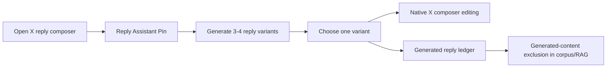

# Reply Variant Assistant Flow Index

| # | Flow | Persona | Screens Touched | Depends On |
|---|---|---|---|---|
| 1 | Choose and edit generated reply variant | Replying Operator | Reply Assistant Pin, Parent/Thread Context Summary, Variant Chooser, Native X Composer | Valid `ReplyComposerContext`, observed thread resolver, reply generation contract |
| 2 | Generated reply exclusion | Future Memory Builder | Ledger Status, corpus import/capture paths | Generated reply ledger, normalized content hash |

## Screen Usage Matrix

| Screen | Choose/edit variant | Generated exclusion |
|---|:---:|:---:|
| Reply Assistant Pin | Yes | No |
| Parent/Thread Context Summary | Yes | No |
| Variant Chooser | Yes | No |
| Native X Composer | Yes | No |
| Ledger Status | Yes | Yes |

## Cross-Flow Dependencies

## Canonical Screen Names

- `Reply Assistant Pin`
- `Parent/Thread Context Summary`
- `Variant Chooser`
- `Ledger Status`
- `Native X Composer`
