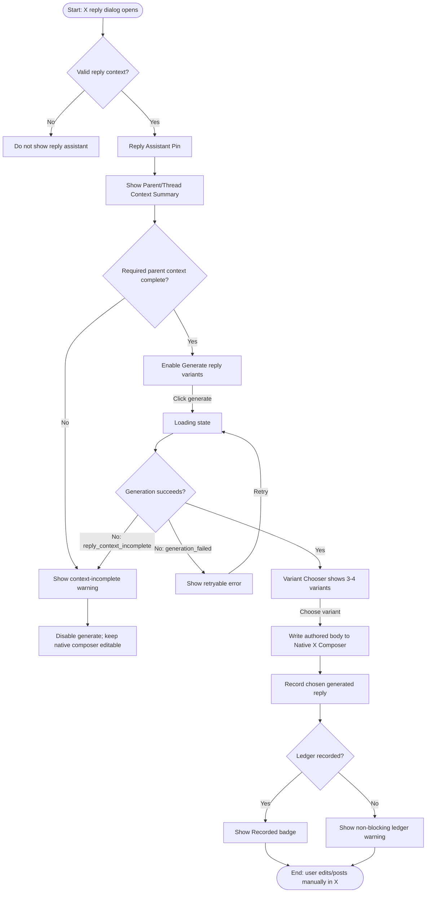

# Flow: Choose And Edit Generated Reply Variant

## Context

A replying operator opens a native X reply composer and asks x-builder for contextual reply help. The flow ends when the user chooses one generated variant, x-builder writes the authored body into the native composer, and the user can edit or post manually in X.

## Entry Points

- X reply dialog: valid active composer plus same-dialog reply evidence from `ReplyComposerContext`.
- Existing compose cockpit mount: `ComposeCockpit` receives `replyContext` and switches to reply assistant mode.
- Context: the user is logged into X and the x-builder engine has LLM readiness.

## Flow Diagram

## Step Descriptions

| # | Step | Description | Screen | Interactions |
|---|---|---|---|---|
| 1 | Detect reply | Overlay receives valid `replyContext`; ordinary post mode does not switch. | Reply Assistant Pin | No user action. |
| 2 | Review context | User sees target author/text plus observed parent/root/thread diagnostics when available. | Parent/Thread Context Summary | Expand/collapse long text if needed. |
| 3 | Generate variants | User clicks a reply-specific generate action. | Reply Assistant Pin | Button enters loading and disables duplicate clicks. |
| 4 | Review variants | User sees 3-4 options with reply move labels, not scores. | Variant Chooser | Keyboard/tab through options. |
| 5 | Choose variant | User selects one variant. | Variant Chooser | Writes body to native composer; focus returns to composer. |
| 6 | Edit manually | User edits in X. | Native X Composer | Native composer remains source of truth; x-builder never posts. |
| 7 | Record generated reply | Chosen generated body is inserted into ledger for future exclusion. | Ledger Status | Non-blocking success/warning state. |

## Error Paths

| Step | Error | User Sees | Recovery |
|---|---|---|---|
| Detect reply | Partial same-dialog evidence | No generated reply assistant | Native composer remains usable. |
| Review context | Parent/root missing where required | Context-incomplete warning | User can write manually; no invented context. |
| Generate variants | LLM unavailable | Error alert with retry after readiness changes | Keep current composer text untouched. |
| Generate variants | Structured output invalid | Error alert | Retry generation. |
| Choose variant | Native composer changed while generation was in flight | Latest split/merge state is re-read before write | Preserve user's current structural handle choice. |
| Record ledger | SQLite write fails | Non-blocking warning | User can still edit/post manually. |

## Edge Cases

- User deleted the leading target handle before choosing a variant: x-builder must not restore it.
- Generated text starts with duplicate target handle: strip it before writing.
- Thread context has diagnostics but enough target context for non-context-dependent generation: show diagnostics as context, not as scoring.
- User clicks generate twice rapidly: second click is disabled while request is pending.
- User closes the X reply dialog mid-request: stale response must be ignored.
- Normal post composer with leading `@handle`: remains authored post text and does not enter reply assistant mode.

## Screen References

| Screen | Route | Type |
|---|---|---|
| Reply Assistant Pin | X reply dialog overlay | Panel |
| Parent/Thread Context Summary | within Reply Assistant Pin | Panel section |
| Variant Chooser | within Reply Assistant Pin | Panel section |
| Ledger Status | within Reply Assistant Pin | Inline status |
| Native X Composer | x.com reply dialog | External/native composer |

## Cross-Flow References

- Generated reply ledger feeds the generated-content exclusion flow.
- Normal post compose flow remains in the existing compose cockpit and is intentionally not changed by this flow.

## Open Questions

- None blocking for MVP. Exact copy can be tuned during implementation but must preserve the boundaries above.

## Metrics / Content / Service Notes

- **Primary metric:** generated variant chosen and written to composer without auto-posting.
- **Events to instrument later:** `reply_variants_requested`, `reply_variant_selected`, `generated_reply_ledger_recorded`, `generated_reply_ledger_failed`.
- **UX copy needed:** context-incomplete warning, generation retry error, ledger status.
- **Backstage dependencies:** reply thread resolver, LLM structured generation, generated reply ledger.
- **Accessibility-critical states:** async result announcements, keyboard variant selection, focus return to composer.
